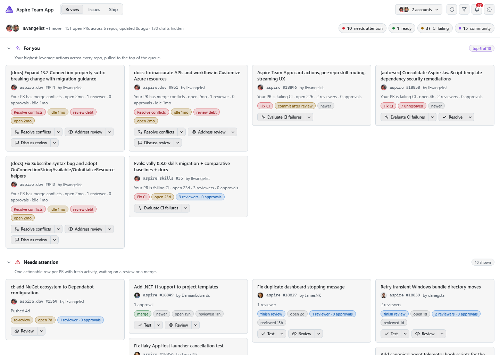
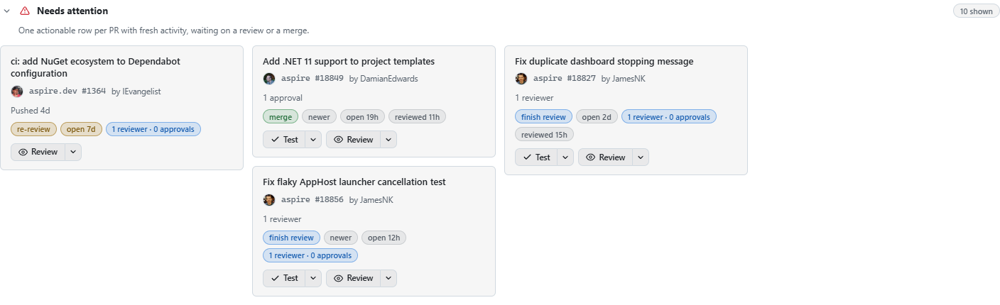

# Aspire Team App (canvas)

A GitHub Copilot App **canvas extension** that combines the
[`davidfowl/pr-dashboard`](https://github.com/davidfowl/pr-dashboard) cross-repo PR
review queue for the **logged-in GitHub user** with repository and delivery health
for watched GitHub repositories and Azure DevOps pipelines. This is
published as the first entry in the Canvas Marketplace.

## Screenshots

The cross-repo review queue — signal pills, a "For you" focus lane, and per-repo
lanes for everything waiting on you:



Per-card action buttons. On github.com PRs — including Enterprise Managed User (EMU)
accounts, whose PRs live on github.com — each button is a split-button dropdown to run
the action in a new sub-session (the PR's own repo) or in the current conversation. Only
GHES (self-hosted, non-github.com) cards can't open a sub-session, so they render a single
button with no dropdown that runs the action in the current conversation. The buttons a
card shows are driven by its lane and its signal pills:

- **Test** / **Review** — someone else's PR that's waiting on you, or any card carrying
  a "re-review" pill (the author pushed after a review). Each self-routes to the repo's
  matching skill (`/pr-testing`, `/code-review`), falling back to a thorough manual pass.
- **Address review** / **Discuss review** — any review-debt card (aged without an
  approving review; a PR that was only commented on or had changes requested still counts
  until it's approved), keyed off the "review debt" pill *and* the review-debt flag so it
  shows everywhere the card appears — Needs attention, *Your PRs outside Needs attention*,
  the breakdown lanes (e.g. Stalled), and Community — regardless of whether the PR is
  yours. Address review runs a fresh review; Discuss review talks through the existing
  feedback and lays out response options without rewriting anything.
- **Address feedback** / **Discuss review** — your own PR with changes requested (the
  "Author response" case, including in *Your PRs outside Needs attention*, which would
  otherwise show no actions). Address feedback works the requested changes; Discuss
  review talks them through and lays out options without rewriting anything.
- **Resolve conflicts** — any card carrying a "merge conflicts" signal; runs a
  direct git conflict-resolution flow.
- **Evaluate CI failures** — any card carrying a "CI failing" signal; self-routes to
  the repo's CI-diagnosis skill (`/ci-test-failures`) or diagnoses manually, then
  reports the failing checks, likely root cause, and a suggested fix.
- **Resolve** — any card with unresolved review threads, matched off every form of the
  pill: the "N unresolved" attention signal, the "Unresolved feedback" bucket / *Your PRs
  outside* reason label, and the "resolve feedback" action pill. Works each thread, makes
  the requested change, and resolves it.



## What it does

- **Review mode** — buckets every open PR across your watched repos into lanes:
  Needs your review, Ready to merge, CI failing, Unresolved feedback, and Your PRs.
- **Issues mode** — Assigned to you, Your issues, Needs triage, Recently active,
  with linked pull requests shown directly on issue cards and opened in in-app
  browser tabs.
- **Ship mode** — PRs in the current release milestone grouped into Ready to ship,
  In progress, and Blocked.
- **Health mode** — default-branch CI state, failure streak, last successful
  validation, days since success, failed checks/stages, and evidence-backed
  explanations for watched GitHub repositories and Azure DevOps delivery pipelines.
  Related provider sources are grouped by repository and each group can be dragged
  into a preferred order that persists across reloads.
- **Signal pills** — Draft, CI failing, Merge conflicts, Changes requested,
  N unresolved, Approved, Ready to merge, Needs review, Quick win, Stalled.
- **Notifications** — review requested, your PR ready to merge, changes requested,
  CI failing, with per-category preferences. Live updates over SSE.
- **Stable background refresh** — GitHub data is assembled into a complete snapshot
  while the current board remains visible, then applied in one update. The compact
  **Auto** toolbar switch can pause automatic UI updates; when paused, an **Apply
  update** pill appears only after changed data is ready. The refresh button tooltip
  counts down to the next background data check.
- **Multiple GitHub accounts** — every detected credential (gh CLI, environment,
  Copilot) appears on the Accounts screen. Activate any number of them and their
  results **interleave across every tab**, de-duplicated by PR/issue URL. Each
  account watches **its own** repositories, editable inline.
- **Enterprise aware** — accounts on a GitHub Enterprise Server host are badged and
  their API calls are routed to that host's GraphQL/REST endpoints.
- **Editable watched repos** — per account; defaults to the public Aspire team set,
  except Enterprise Managed User (EMU) accounts (e.g. `dapine_microsoft`), which
  default to the first-party `devdiv-microsoft/aspire-1p` repo. Defaults only fill
  in accounts you haven't configured — they never overwrite an explicit repo list.

## Health mode

Health mode checks the default branch of every watched GitHub repository. When
`microsoft/aspire` is watched, it also checks the known `dnceng/internal`
`microsoft-aspire` mirror for the curated official CodeQL, NuGet release, and CI
pipelines. This first-party discovery does not depend on the Azure CLI's configured
defaults, excludes the unofficial pipeline, and quietly skips the internal sources
when the CLI, authentication, or repository access is unavailable.

Separately, the app checks the Azure CLI's configured default organization and
project for Azure Repos whose name uniquely matches a watched github.com repository.
For each unambiguous match, it auto-discovers one enabled delivery pipeline,
preferring production, release, deployment, or publish definitions over a generic
build. Merge, mirror, cleanup, provisioning, generated, old, unofficial, and disabled
definitions are ignored. The catalog is cached for ten minutes, and discovery never
scans other Azure DevOps projects or organizations.

Paste a pipeline URL such as
`https://dev.azure.com/{org}/{project}/_build?definitionId={id}` or a build-results
URL into **Settings → Azure DevOps pipelines** to monitor additional definitions.
A branch override is optional. Legacy `{org}.visualstudio.com` URLs are also
supported. Explicit and discovered definitions are de-duplicated by canonical
pipeline ID.

Azure DevOps access reuses the installed Azure CLI and `azure-devops` extension.
Authenticate with an existing `az` session or `AZURE_DEVOPS_EXT_PAT`. The app stores
only normalized pipeline coordinates and branch preferences; it never stores tokens
or other credentials. GitHub and Azure DevOps sources are loaded independently, so
an unavailable provider does not hide results from the other provider.

When a configured Azure pipeline builds a watched GitHub repository directly, provider
metadata links both sources into one repository group. Azure Repos mirrors do not expose
an upstream GitHub origin, so the app discovers and groups a mirror only when its
repository name has exactly one normalized GitHub match. Curated first-party sources
are labeled **Official default**; default-project matches are labeled
**Auto-discovered**. Both use a repository-name group, and ambiguous names remain
separate.

| State | Meaning |
| --- | --- |
| **Healthy** | The latest default-branch validation or pipeline build succeeded. |
| **Running** | Validation is queued, expected, or in progress. |
| **Degraded** | Azure DevOps reported a partially successful result or another non-fatal issue. |
| **Failing** | The latest validation failed, timed out, was cancelled, or requires action. |
| **Unknown / unavailable** | No CI signal exists, authentication is missing, or the source could not be queried. |

Days since success is an indicator, not an inactivity alarm: a quiet repository does
not become unhealthy solely because it has not received commits. Explanations are
deterministic and conservative. The app names failing checks, stages, jobs, or tasks;
reports failure streaks; identifies a Dependabot auto-merge as a **likely** regression
source only when GitHub exposes both bot authorship and auto-merge metadata; and calls
a deployment **likely blocked upstream** only when the same Azure DevOps timeline has
a failed build stage and a skipped deployment stage.

Health cards do not invoke AI during refresh. **Diagnose here** asks the current
session to refetch and investigate the canonical source. **Fix in repo** opens a
mapped github.com repository session; sources without a mapped GitHub repository use
**Work fix here** in the current session. The browser sends only the source ID, and
the loopback server resolves provider coordinates from its last complete snapshot.
Actions never trigger, retry, approve, or otherwise mutate CI/CD systems.

Drag a repository group from its grip to prioritize it, or focus the grip and use the
arrow keys. Every source in the group moves together. The app saves the flattened source
order in durable preferences and broadcasts changes to other open canvas instances
without refetching provider data.

## How it works

| File | Responsibility |
| --- | --- |
| `extension.mjs` | Wiring: `joinSession` + `createCanvas`, agent-facing actions. |
| `server.mjs` | Per-instance loopback HTTP server, atomic complete-snapshot cache, background polling, SSE refresh, multi-account interleave, and health orchestration. |
| `accounts.mjs` | Credential discovery, per-account repo-access probing, host/enterprise detection. |
| `github.mjs` | GraphQL queries, lane bucketing, signals, avatars, cross-account merge. |
| `health.mjs` | GitHub default-branch health and provider-neutral health aggregation. |
| `azure-devops.mjs` | Pipeline URL validation, read-only Azure CLI queries, build timelines, Azure health inference. |
| `model.mjs` | Attention buckets, focus queue, core-team / community classification. |
| `constants.mjs` | Configuration: core-team members, release milestone, personal picks. |
| `render.mjs` | Iframe HTML / CSS / client JS, styled with Copilot theme tokens. |
| `agent.mjs` | Card-action prompt/log builders (Test, Review, Resolve conflicts, Address review, Evaluate CI failures, Discuss review, Address feedback) with untrusted-PR hardening. |
| `health-agent.mjs` | Canonical health-action routing and injection-hardened diagnosis/fix prompts. |
| `state.mjs` | Durable preferences (watched repos, active accounts, notifications, refresh behavior, Azure pipeline coordinates, and health card order). |

The canvas reads each account's token from `GH_TOKEN` / `GITHUB_TOKEN`, the
per-account Copilot credentials, or `gh auth token`, and queries the matching
GitHub GraphQL API. Azure DevOps queries use the existing Azure CLI authentication.
No credential is written to the extension preferences.

## Agent actions

- `refresh` — reload the queue and push to the open dashboard.
- `set_mode` — switch to `review` / `issues` / `ship` / `health`.
- `set_repos` — replace the watched repositories for an account (targets the first
  active account unless `account` id/login is given).
- `set_account_active` — activate or deactivate an account by id/login; active
  accounts interleave across every tab.
- `add_azure_pipeline` — validate and add an Azure DevOps pipeline/build URL, with
  an optional branch override; the result includes opaque removal keys.
- `remove_azure_pipeline` — remove a configured Azure DevOps pipeline using a
  removal key returned by `add_azure_pipeline` or the Health summary.
- `accounts` — list every detected credential, its active state, and repo access.
- `summary` — return PR/issue counts or Health status counts and reasons without
  opening the canvas.

## Install

This extension ships in the repository under `.github/extensions/aspire-team-app/`, so
the GitHub Copilot app auto-discovers it as a **project extension** whenever this repo is
opened. No manual install step is required.

It is also published to the Canvas Marketplace and can be installed standalone:

```text
install_extension url: https://github.com/IEvangelist/canvas-marketplace/tree/main/canvases/aspire-team-app
```

Once loaded, open it from chat, or via `open_canvas` with `canvasId: "aspire-team-app"`.

## Notes

- Notifications are **in-canvas + live in-session** (SSE). A canvas iframe is not a
  PWA with a service worker, so OS-level push while the app is closed is out of
  scope for v1.
- `copilot-extension.json` lets the folder install as a gist as well as a repo
  folder. `extension.mjs` must keep that exact filename.
