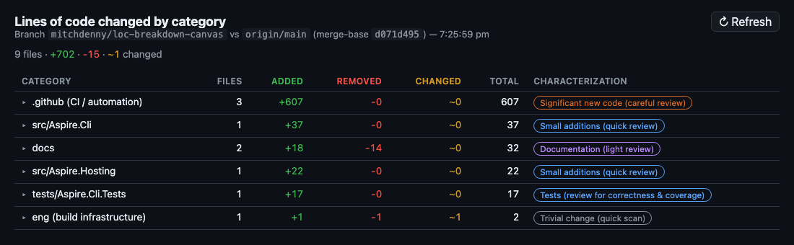

# LOC breakdown canvas extension

A Copilot CLI canvas extension that shows a breakdown of the lines of code
changed in the current branch, grouped by project/category, with a heuristic
characterization of each group (mechanical / detailed / careful review etc).

## What it does

When opened, the canvas:

1. Resolves the merge-base of the current branch against `origin/HEAD` (or
   `main`/`master` as a fallback).
2. Runs `git diff --numstat` between that merge-base and `HEAD`.
3. Groups files into buckets that reflect the Aspire repo layout — each
   `src/<Project>`, `src/Components/<Component>`, `tests/<Suite>`,
   `playground/<App>`, `tools/<Tool>`, plus catch-all buckets for
   `docs`, `eng`, `.github`, the VS Code extension, and `.agents`.
4. Sorts categories by total lines touched (added + removed), descending.
5. Tags each category with a short characterization derived from file types
   and the add/remove ratio:

   | Tone | Examples |
   |------|----------|
   | Mechanical | localization, generated files, snapshots, assets, trivial edits |
   | Documentation | `.md`/`.mdx`/`.txt` only |
   | Detailed | tests, small additions, moderate edits |
   | Careful | CI workflows, significant new code, large removals, big refactors |

Rows are expandable to show the per-file added/removed counts within a
category.

## Usage

In any Copilot CLI session inside this repo, ask the agent to open the
"LOC breakdown" canvas (or any phrasing that implies wanting a per-project
summary of the diff). The canvas has a ↻ Refresh button and a `refresh`
action the agent can invoke to recompute the report.

Optional inputs when opening the canvas:

- `cwd` — working directory inside a git repo (defaults to the active session's working directory, falling back to the extension process cwd)
- `base` — base ref to diff against (defaults to `origin/HEAD`)
- `head` — head ref (defaults to `HEAD`)

## Implementation notes

- Single-file extension; no dependencies beyond the Node.js standard library
  and `@github/copilot-sdk/extension`.
- Spins up a loopback HTTP server on an ephemeral port per canvas instance
  and tears it down on close.
- The HTML shell fetches `/data` and renders client-side, so refresh is
  cheap and doesn't require restarting the server.

## Discovery

Project-scoped extensions in `.github/extensions/` are picked up
automatically by the Copilot CLI for anyone working in this repo — no
install step is required.
