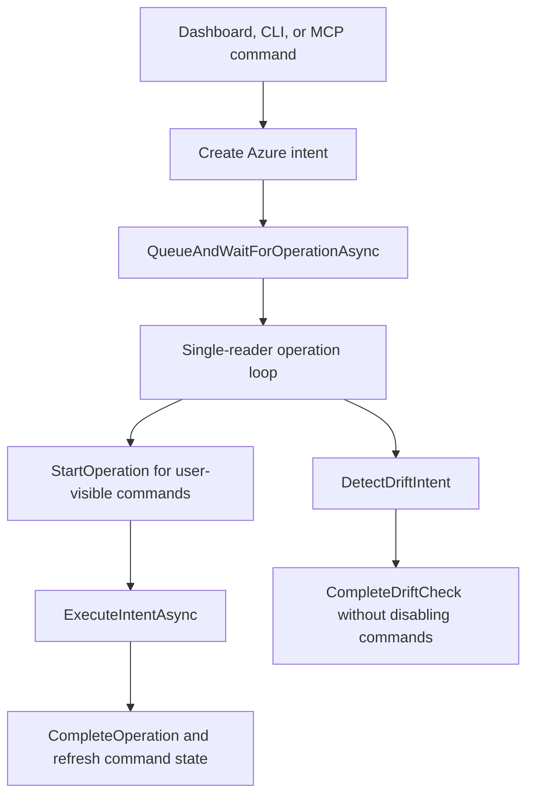
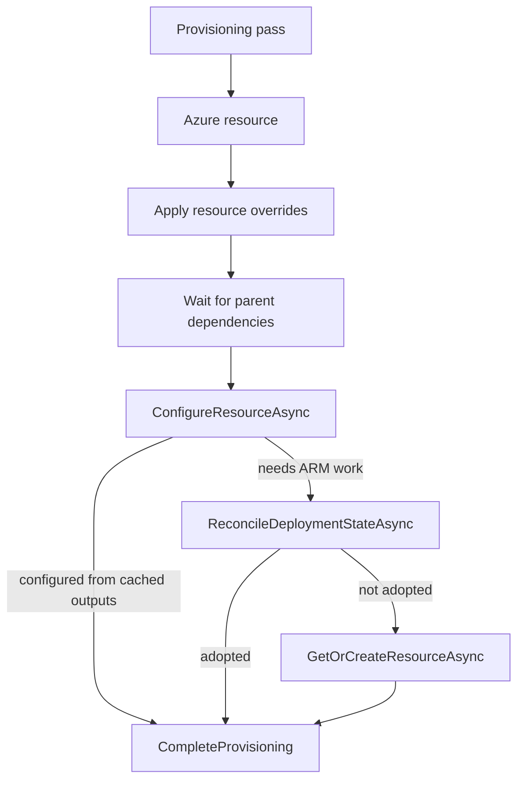

# Azure run-mode provisioning reconciliation

This document describes how Aspire coordinates Azure run-mode provisioning, cancellation, drift detection, and ARM deployment reconciliation. It is intended for Aspire contributors working on `Aspire.Hosting.Azure` resource commands and recovery behavior.

## Scope

This spec covers run-mode behavior in the AppHost and dashboard:

- Azure resource commands started by the dashboard, CLI, or MCP.
- Active operation tracking and cancellation.
- Background drift detection.
- Reconciliation of cached ARM deployments after AppHost restart, command cancellation, or active deployment conflicts.
- Recovery behavior for resources with implicit child Azure resources, such as PostgreSQL password Key Vaults.

It does not cover publish-mode infrastructure generation, azd deployment, or non-Azure resource lifecycle orchestration.

## Terms

| Term | Meaning |
| ---- | ------- |
| Azure intent | A typed operation request handled by `AzureProvisioningController`, such as provision, reprovision, delete, reset, forget state, change location, cancel, or drift check. |
| Active Azure operation | In-memory controller state for the currently executing user-visible Azure operation. It drives command enablement, cancellation, dashboard status, and operation metadata. |
| Queued Azure operation | A command waiting behind the controller's single-reader channel. Queued mutations are tracked so conflicting commands can fail before corrupting state. |
| Deployment state section | Persisted state under `Azure:Deployments:<resource-name>` that records ARM deployment metadata, outputs, resource IDs, scope, location, checksum, and sometimes provisioning state. |
| Cached running deployment | A deployment state section whose `ProvisioningState` is `Running` and whose `Id` points to an ARM deployment that may still be active. |
| Reconciliation | The process of treating cached Aspire state as a pointer to ARM, probing ARM as the source of truth, and adopting or clearing that state before a fresh deployment is started. |
| Drift | A mismatch where Aspire has cached local state for a running Azure resource, but ARM no longer reports the target resource as existing. |

## Design goals

1. Serialize Azure mutations so dashboard, CLI, MCP, and background checks cannot race each other.
2. Keep command success terminal: a command completes when the requested Azure operation has reached a terminal result, not merely when the operation was accepted.
3. Allow cancellation to be requested without waiting behind the operation queue.
4. Reattach to existing ARM work after AppHost restart or cancellation instead of starting duplicate deployments.
5. Preserve actionable terminal ARM failures and cancellations instead of hiding them behind automatic retries.
6. Avoid leaking secrets or PII in diagnostics. Cached deployment parameters must not be exposed through user-facing resource commands.

## Controller operation loop

`AzureProvisioningController` is the synchronization boundary for run-mode Azure behavior. Public entry points wrap requests in an Azure intent and write them to a channel with a single background reader.



All user-visible mutations use the same queue. This avoids re-entrancy between dashboard command handlers, CLI command handlers, provisioning callbacks, and background drift checks.

Drift detection also uses the queue, but it is intentionally not treated as a user-visible active operation. A drift check must serialize with mutations, but it should not make dashboard command buttons flicker disabled while it probes ARM.

## Operation lifecycle

For queued user-visible operations, the controller:

1. Starts or reuses the background operation loop.
2. Registers queued operation state so conflicting mutations can be detected before execution.
3. Dequeues one intent at a time.
4. Creates an `ActiveAzureOperation`.
5. Refreshes command state so conflicting dashboard commands are disabled immediately.
6. Executes the intent with the active operation cancellation token.
7. Completes the caller task with success, failure, or cancellation.
8. Clears the active operation.
9. Refreshes command state with `CancellationToken.None` so commands are re-enabled even when the original operation was canceled.

The active operation tracks the affected resources, operation display name, phase, status text, start time, and a linked cancellation token. Resource command enablement uses this state to keep read-only diagnostics available while disabling conflicting mutations.

## Cancellation

Cancellation has two paths:

| Path | Behavior |
| ---- | -------- |
| Current active operation | `cancel` cancels the active operation token immediately and publishes `Canceling` for resources still in flight. This path does not wait behind the serialized operation queue. |
| Cached running deployments | `cancel` best-effort cancels matching ARM deployments recorded in cached deployment state. This supports recovery after the original AppHost process is gone. |

The cancel command reports that cancellation was requested. Azure may still continue work in the background, so follow-up reconciliation must observe ARM's terminal state rather than assuming the request stopped all provider-side work.

## Per-resource provisioning pass

Within a provisioning operation, resources are fanned out concurrently but dependency ordering is preserved with per-resource provisioning completion tasks.



`ConfigureResourceAsync` is tried first because local outputs or user secrets may already contain enough information to satisfy the resource. If not, the provisioner is asked to reconcile cached ARM deployment state before starting new ARM work.

## ARM deployment reconciliation

`BicepProvisioner.ReconcileDeploymentStateAsync` is the run-mode recovery step for a single `AzureBicepResource`.

The persisted section shape is conceptually:

```text
Azure:Deployments:<resource-name>
  Id = /subscriptions/<subscription>/resourceGroups/<group>/providers/Microsoft.Resources/deployments/<deployment-name>
  Scope = {"resourceGroup":"<group>","subscription":"<subscription>"}
  CheckSum = <model-checksum>
  ProvisioningState = Running
```

The actual cached state can contain more fields such as outputs, resource IDs, location, and provider metadata. User-facing diagnostics must not expose cached deployment parameters because parameters can contain secrets.

Reconciliation follows these rules:

| Cached or ARM state | Result |
| ------------------- | ------ |
| Not run mode | Return `false`; publish-mode does not adopt local run-state. |
| No cached running deployment | Return `false`; caller may provision normally. |
| Cached deployment ID missing or malformed | Return `false`. |
| ARM probe cannot run because credentials are unavailable or the request fails | Return `false` and leave cached state intact. |
| ARM deployment no longer exists | Clear stale running state and return `false`. |
| ARM deployment is active | Poll the existing deployment until it becomes terminal. |
| ARM deployment succeeded | Persist outputs, update local state, configure the resource, and return `true`. |
| ARM deployment canceled | Persist `Canceled`, publish a canceled resource state, and throw. |
| ARM deployment failed | Persist `Failed`, publish a failed resource state, and throw. |
| ARM deployment has another terminal or unknown state | Return `false`; caller may reprovision normally. |

ARM remains the source of truth. Cached Aspire state identifies which deployment to inspect, but reconciliation only adopts the result after ARM confirms the deployment still exists and has a known state.

## Polling adopted deployments

When reconciliation finds an active ARM deployment, `WaitForCachedRunningDeploymentAsync` polls ARM until the deployment becomes terminal.

Each polling iteration:

1. Rebuilds the deployment URL from the cached ARM deployment ID.
2. Publishes a `Waiting for Deployment` resource state.
3. Queries deployment operations.
4. Publishes a best-effort summary of operation progress and failures.
5. Waits for the deployment polling interval.
6. Probes the ARM deployment again.

If the deployment disappears during polling, reconciliation clears the stale running marker and returns `false`, allowing a normal reprovision attempt. If an intermediate ARM progress query fails, reconciliation leaves cached state intact and falls back to the normal provisioning decision rather than turning a transient progress-query failure into a hard recovery failure.

## Active deployment conflict adoption

ARM can reject a create or update because another deployment with the same name is already active. When that happens, the provisioner can probe the conflicting deployment and, if it belongs to the current model, wait for it instead of surfacing the conflict immediately.

This path uses the same polling and terminal-state adoption rules as cached running deployment reconciliation. If the deployment cannot be found, disappears, or reaches an unknown state, the provisioner leaves the original ARM conflict behavior intact.

## Drift detection

After the Azure environment is `Running`, a background monitor periodically queues a drift check.

A drift check:

1. Runs only when the Azure environment resource is currently `Running`.
2. Requires a valid subscription ID.
3. Iterates provisionable Azure resources.
4. Skips resources without cached resource IDs.
5. Calls ARM to verify each cached resource ID still exists.
6. Marks missing resources as drifted or missing in Azure.
7. Marks the Azure environment as drifted if any resource is missing.

Resources without cached IDs are not checked because Aspire does not have enough information to ask ARM about the expected live resource.

## Recovery behavior

The current recovery model works best when at least one of these is true:

- Aspire has a cached running deployment ID that ARM can still inspect.
- Aspire has cached target resource IDs that can be deleted, purged, or checked for existence.
- The failed ARM response contains enough target metadata for a resource-specific recovery path.

Example no-restart recovery for a manually deleted implicit Key Vault when cached resource state is still usable:

```bash
aspire resource <parent-resource> cancel
aspire resource <key-vault-child> delete-azure-resource
aspire resource <key-vault-child> reprovision
aspire resource <parent-resource> reprovision
```

The important ordering is child first, then parent. The parent resource often depends on outputs or secrets produced by the implicit child resource. Reprovisioning the parent before repairing the child can surface a generic parent failure instead of fixing the actual dependency.

## Key Vault soft-delete handling

Key Vault has special recovery behavior because deleting a vault leaves a location-scoped soft-delete tombstone. A later create with the same globally unique vault name can fail even when the live vault no longer exists.

Current behavior:

- `delete-azure-resource` cancels known cached deployments before collecting target IDs for deletion.
- Key Vault delete may continue into purge after the live vault is gone.
- Delete tolerates a Key Vault purge timeout after live deletion, because a later reprovision can retry when the tombstone is eventually gone.
- Reprovision is stricter. If ARM reports a Key Vault soft-delete conflict with a target resource ID, Aspire purges the matching tombstone and retries once, because the same resource name is needed immediately.

Known gap:

- If ARM reports that a vault name is blocked by a deleted-state conflict, but Aspire has no cached child resource ID and Azure deleted-vault APIs cannot find the tombstone, Aspire cannot currently purge, recover, or rename the implicit child without changing the AppHost model and restarting.

## Follow-up design requirements

Future fixes for the known gap should preserve these invariants:

1. Parent reprovision should repair owned implicit children before retrying the parent deployment.
2. ARM failure target metadata should be preserved when it identifies a failed child resource, even if normal cached deployment state lacks a resource ID.
3. Diagnostics should distinguish between missing local state, missing live resource, failed deleted-vault lookup, and ARM deleted-state conflict.
4. Read-only diagnostics and cancellation must remain available while conflicting mutations are rejected or queued.
5. Public reports, issue comments, and shareable artifacts must scrub subscription IDs, tenant IDs, resource group names, local paths, dashboard tokens, cached deployment parameters, and secrets. Trusted local diagnostics may include provider identifiers when needed for recovery, but cached deployment parameters must remain omitted from user-facing resource command output.

## Implementation map

| Area | Primary type | Responsibility |
| ---- | ------------ | -------------- |
| Operation serialization | `AzureProvisioningController` | Queue intents, start active operations, execute one operation at a time, refresh command states. |
| Cancellation | `AzureProvisioningController` | Cancel active operation tokens and best-effort cancel cached ARM deployments. |
| Drift detection | `AzureProvisioningController` | Periodically queue ARM existence checks for cached resource IDs. |
| Resource provisioning order | `AzureProvisioningController` | Fan out resources while respecting dependencies through per-resource completion tasks. |
| Deployment reconciliation | `BicepProvisioner` | Adopt cached running deployments, active deployment conflicts, and terminal ARM states. |
| ARM resource operations | `IArmClientProvider` implementations | Delete, purge, existence checks, deployment probes, and provider-specific polling. |
