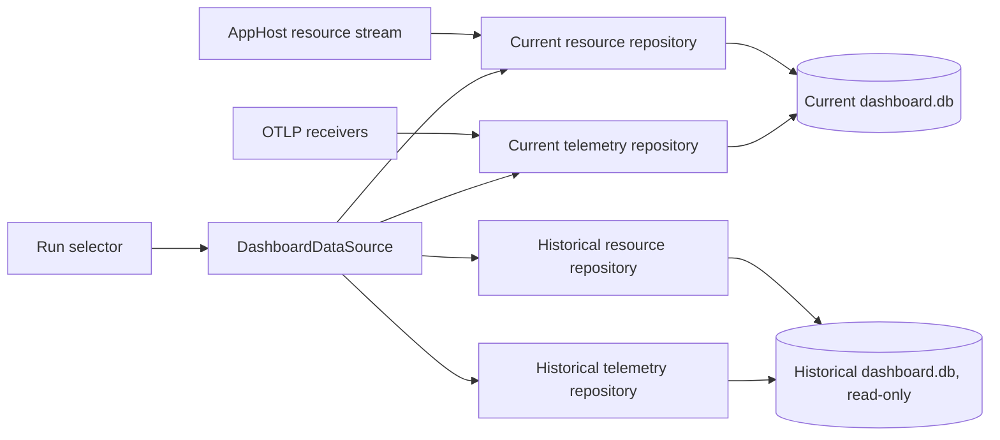

# Dashboard persistence

**Status:** Implemented by [microsoft/aspire#18768](https://github.com/microsoft/aspire/pull/18768)

## Summary

The Aspire Dashboard stores resource snapshots and telemetry in SQLite. Persistence makes completed application runs available after the AppHost and Dashboard processes stop, while retaining the live Dashboard experience for the active run.

The design has three persistence modes:

| Mode | Database lifetime | Historical run selection | Default use |
|------|-------------------|--------------------------|-------------|
| `None` | One temporary database per Dashboard process | No | Standalone Dashboard |
| `Run` | One persistent database per Dashboard process | Yes | AppHost Dashboard |
| `Resume` | One persistent database reused by later Dashboard processes | No | Explicit opt-in |

## Usage examples

### `None`: temporary standalone Dashboard

The standalone Dashboard defaults to `None`:

```bash
aspire dashboard run
```

This mode is useful for inspecting telemetry during a single development or diagnostic session. Data is lost when the CLI process or standalone Dashboard container stops.

### `Run`: compare AppHost runs

An AppHost-launched Dashboard defaults to `Run`; no additional configuration is required. Each time the AppHost starts, the Dashboard creates a separate run database. After changing the application code and restarting the AppHost, use the run selector to compare the current telemetry and resources with historical runs and evaluate the impact of the change.

### `Resume`: long-running standalone Dashboard

A standalone Dashboard can reuse one persistent database across restarts. For a CLI-managed Dashboard, select `Resume` and give the application a stable name:

```bash
aspire dashboard run --application-name my-app --persistence Resume
```

The CLI uses the configured data directory or the default directory under `ASPIRE_HOME`. A container must mount the configured data directory from persistent storage. For example, a Docker named volume preserves the database when the container stops or is replaced:

```bash
docker volume create aspire-dashboard-data

docker run --rm -d \
    --name aspire-dashboard \
    -p 18888:18888 \
    -p 4317:18889 \
    -p 4318:18890 \
    --mount type=volume,source=aspire-dashboard-data,target=/dashboard-data \
    --env ASPIRE_DASHBOARD_APPLICATION_NAME=my-app \
    --env ASPIRE_DASHBOARD_DATA_DIRECTORY=/dashboard-data \
    --env ASPIRE_DASHBOARD_PERSISTENCE_MODE=Resume \
    mcr.microsoft.com/dotnet/aspire-dashboard:latest
```

Restart the container with the same volume, application name, data directory, and persistence mode to continue using the existing database. The Dashboard can remain running through idle periods, and its data remains available after stop and restart, subject to the configured telemetry retention limits.

The AppHost console-log protocol does not identify the AppHost generation that produced a line. Resume prioritizes preserving logs from later AppHost generations, whose line numbers restart at 1. If the Dashboard restarts while the same AppHost remains running, console logs replayed by that AppHost can therefore be persisted again.

## Goals

- Preserve resources, console logs, structured logs, traces, spans, and metrics after an application run ends.
- Let users switch between the current run and completed runs without reloading the Dashboard.
- Keep historical runs read-only so viewing old data cannot affect the active application.
- Execute filtering, searching, paging, aggregation, field-value lookup, and retention in SQLite instead of loading the full data set into memory.
- Support high-volume ingestion through normalized storage, batched commands, transactions, and targeted caches.
- Keep the in-memory and SQLite telemetry repository contracts behaviorally equivalent where practical.

## Non-goals

- Providing a durable production telemetry backend or replacing an observability service.
- Sharing a writable database across machines or Dashboard processes.
- Replication, backup, or database-level user authentication.
- Encryption at rest. Protection of persisted data is delegated to the containing directory's access controls.
- Migrating persisted data between incompatible schema versions.

## Configuration

The Dashboard binds persistence settings from configuration or their environment-variable equivalents:

| Configuration key | Environment variable | Description |
|-------------------|----------------------|-------------|
| `Dashboard:ApplicationName` | `ASPIRE_DASHBOARD_APPLICATION_NAME` | Logical application name that partitions persisted data |
| `Dashboard:Data:Directory` | `ASPIRE_DASHBOARD_DATA_DIRECTORY` | Root directory for persistent Dashboard data |
| `Dashboard:Data:PersistenceMode` | `ASPIRE_DASHBOARD_PERSISTENCE_MODE` | `None`, `Run`, or `Resume` |

An AppHost-launched Dashboard receives the normalized application name and defaults to `Run`. The AppHost can override the mode with `Aspire:Dashboard:PersistenceMode` or `ASPIRE_DASHBOARD_PERSISTENCE_MODE`.

The standalone `aspire dashboard run` command accepts `--application-name` and `--persistence`. It does not set a persistence default, so the Dashboard default of `None` applies unless configuration, an environment variable, or the command-line option selects another mode.

When no data directory is configured, persistent modes use the `dashboard` directory under `ASPIRE_HOME`, whose default is the current user's `.aspire` directory. The configured directory must be scoped to and protected for the current user.

On Unix, the per-application directory beneath the data root is created with owner-only (`0700`) permissions. Existing application directories are also restricted to that mode before persistent data is accessed. On Windows, the directory is created without Unix permission flags and uses the inherited ACL.

## Storage layout

Persistent data is partitioned by application. The application directory name contains a readable prefix and a stable hash:

```text
<sanitized-application-name>-<16-character-xxhash3>
```

The prefix preserves ASCII letters, digits, `-`, and `_`; other characters become `-`. It is trimmed and truncated so the complete directory name is at most 80 characters. The hash prevents different original names that sanitize to the same prefix from colliding.

### `None`

```text
<system-temp>/aspire-dashboard-<random>/
└── dashboard.db
```

The Dashboard creates the directory with `Directory.CreateTempSubdirectory`, removes it on clean shutdown, and opportunistically removes abandoned `aspire-dashboard-*` directories that contain a database and are not locked by another process.

### `Run`

```text
<data-root>/
└── <application-directory>/
    └── runs/
        ├── <utc-run-id>.lock
        └── <utc-run-id>/
            ├── dashboard.db
            └── run.json
```

Run IDs use the UTC start time in `yyyyMMddTHHmmssfffZ` format. `run.json` contains:

- schema version
- run ID
- UTC start and end times
- clean-shutdown flag
- application name
- database file name

The metadata is written only after the database schema is initialized, so an interrupted startup does not publish an unusable run. On graceful disposal it is rewritten with the end time and `CleanShutdown` set to `true`. A published run left with `CleanShutdown` set to `false` is still discoverable after its process releases the lock; the flag records how it ended rather than disqualifying its data.

### `Resume`

```text
<data-root>/
├── <application-directory>.lock
└── <application-directory>/
    └── dashboard.db
```

Later Dashboard processes continue writing to the same database. This mode does not create run metadata or expose the run selector.

SQLite can also create `dashboard.db-wal` and `dashboard.db-shm` beside a writable database.

## Run ownership and retention

Each writable run has an adjacent lock file held open with exclusive sharing and `DeleteOnClose`. An adjacent lock lets a cooperating process hold the lock while deleting the run directory on Windows. A second Dashboard cannot use the same `Run` directory or `Resume` application database while its owner holds the lock.

Historical discovery only includes directories that:

- are not the current run;
- are not locked by another Dashboard process;
- have readable, valid `run.json` metadata; and
- have the current metadata schema version.

Run discovery orders pinned runs before unpinned runs, then orders each group by descending start time. The run selector applies its presentation order separately: the current run is first, followed by pinned historical runs and then unpinned historical runs, with each historical group ordered by descending start time. Pin state is stored in `run.json`; both current and historical runs can be pinned or unpinned.

`Run` mode retains the five newest unpinned historical run directories. The current run and pinned historical runs do not count toward this limit, so the total number of retained runs is not fixed. Pruning happens after a new run writes its metadata. Before deleting a candidate, the pruner acquires its lock and rechecks its pin state. A historical run selected by another Dashboard circuit or a run owned by another Dashboard process is skipped, which can temporarily leave more than five unpinned historical runs. I/O and access failures are logged and do not prevent Dashboard startup.

## Database lifecycle

All modes use the same SQLite repositories. `None` changes only the directory lifetime.

The Dashboard uses the `Microsoft.Data.Sqlite.Core` package and explicitly references `SQLitePCLRaw.bundle_e_sqlite3` so the native SQLite runtime can be updated independently from the managed provider.

The current schema version is stored as exactly one row in `dashboard_schema`. Ordered embedded scripts under `ServiceClient/DatabaseSchema` initialize the schema in one transaction. Schema creation enables:

```sql
PRAGMA journal_mode = WAL;
PRAGMA synchronous = NORMAL;
```

WAL lets readers continue while the writer commits. `synchronous=NORMAL` preserves database consistency while allowing a power loss to discard the newest transactions, which is an acceptable tradeoff for development telemetry.

There are no schema migrations. Behavior on incompatibility depends on the mode:

- `None` always starts with a new temporary database.
- `Run` creates a new database for each process and ignores historical runs whose metadata schema version is incompatible.
- `Resume` deletes the database, WAL, and shared-memory files and creates a new database only after reading a schema version that is incompatible. Failures while probing compatibility are surfaced and leave the existing files in place.
- Opening a selected historical run validates that its database schema matches its metadata and fails the switch if it does not.

## Data model

The schema is normalized and uses SQLite `STRICT` tables, foreign keys, cascade deletion, and query-specific indexes. OTLP payloads are not stored as opaque JSON or protobuf blobs.

### Resources and console logs

`dashboard_resources` stores the latest snapshot for each resource replica. Child tables preserve ordered environment variables, URLs, volumes, health reports, relationships, properties, commands, command inputs, input options, and validation errors.

`console_logs` stores resource name, line number, content, and whether the line came from standard error. An index supports ordered retrieval by resource.

### Shared telemetry identity

`telemetry_resources` identifies a resource and optional service instance and records which signal types it has produced. Resource views preserve the resource attributes associated with an individual telemetry item.

`telemetry_scopes` and `telemetry_scope_attributes` normalize instrumentation scope data shared by logs, spans, and metrics. Scope identity intentionally uses only the scope name; the version and attributes from the first observed scope are retained.

### Structured logs

`telemetry_logs` stores resource and scope references, timestamp, severity, message, trace and span correlation, flags, original format, and event name. `telemetry_log_attributes` stores ordered key/value attributes.

Indexes support global and per-resource time ordering, trace and span correlation, and case-insensitive attribute filtering.

### Traces and spans

`telemetry_traces` stores query-oriented summaries, including first and last timestamps, duration, display name, primary span, error state, and generative-AI state.

`telemetry_spans` stores span identity, parent, resource view, scope, name, kind, timestamps, status, trace state, and resolved uninstrumented peer. Related tables store:

- per-trace resource summaries and ordering;
- span attributes;
- events and event attributes; and
- links and link attributes.

Summary tables and indexes let trace list queries avoid reconstructing every trace. When a late parent or another change invalidates an incremental summary, the repository rebuilds the affected trace data rather than all stored traces.

### Metrics

`telemetry_metric_instruments` identifies instruments by resource, scope, and name and stores type, temporality, monotonicity, unit, and description.

Metric dimensions are normalized into an attribute set and stable non-cryptographic hash. Points store timestamps, point type, repeated-value count, integer or floating-point values, and histogram data. Histogram bucket counts and explicit bounds are compact binary values rather than JSON. Exemplars and their filtered attributes are separate rows correlated to trace and span IDs.

Indexes support instrument lookup, dimension matching, time-window queries, retention, and exemplar lookup.

## Repository behavior

`DashboardDataSourcePool` owns the current writable database and pools selected historical databases across Blazor circuits. `DashboardDataSource` is scoped to a circuit and exposes the resource and telemetry repositories for that circuit's selected run.



Selecting `Current` uses the pool-owned writable repositories. Selecting a historical run:

1. Acquires the run lock so pruning cannot remove it while selected.
2. Opens the database with `SqliteOpenMode.ReadOnly`.
3. Validates the schema version.
4. Reference-counts and shares the database across circuits.
5. Releases the database and run lock after the last circuit stops using it.

The replacement database and repositories are acquired and validated before the selected data source changes. If acquisition or validation fails, the previous repositories and run lease remain active. Interactive failures are logged without terminating the Blazor circuit, and browser session storage retains the run that remains selected.

The repository interfaces preserve subscriptions and watcher behavior for the live database. Historical repositories are immutable snapshots: write methods reject calls, and pages do not register for incoming telemetry updates.

## Write and query strategy

SQLite has one writer. `DashboardSqliteDatabase.WriteLock` serializes resource and telemetry writes before they begin transactions. Add operations batch rows and commands, perform related writes in a transaction, and roll back the batch on failure.

Connection strings enable foreign keys and pooling and use a five-second default timeout. Repository-level caches avoid repeated lookups for stable resource views, scopes, telemetry resources, instruments, and dimensions. Writes invalidate the affected query caches.

The repositories push work into SQL for:

- text and structured-field filtering;
- attribute key and value lookup;
- stable paging and ordering;
- trace summaries and resource aggregation;
- metric dimension and time-window aggregation; and
- count- and time-based retention cleanup.

This keeps memory proportional to the requested page or active ingestion batch rather than the complete run history.

## Data limits and performance

The Dashboard applies these default ingestion limits:

| Configuration key | Default | Scope and behavior |
|-------------------|---------|--------------------|
| `Dashboard:TelemetryLimits:MaxLogCount` | 10,000 | Structured logs per database |
| `Dashboard:TelemetryLimits:MaxTraceCount` | 10,000 | Traces per database |
| `Dashboard:TelemetryLimits:MaxMetricsCount` | 50,000 | Metric points per dimension |
| `Dashboard:TelemetryLimits:MaxAttributeCount` | 128 | Attributes per telemetry item |
| `Dashboard:TelemetryLimits:MaxAttributeLength` | Unlimited | Attribute value length |
| `Dashboard:TelemetryLimits:MaxSpanEventCount` | Unlimited | Events per span |
| `Dashboard:TelemetryLimits:MaxResourceCount` | 10,000 | Distinct OTLP resources |

The oldest logs, traces, and metric points are removed when their limits are exceeded. Fixed limits of 10,000 also apply to resource views per resource, scopes per database, instruments per resource, and dimensions per instrument; additional identities are rejected.

Console logs are persisted only after their stream is viewed or exported. The frontend keeps up to `Dashboard:Frontend:MaxConsoleLogCount` entries in memory, which defaults to 10,000, but persisted console logs are unbounded. Historical runs can therefore omit uncaptured logs or contain many captured logs.

### Database file size

The Dashboard does not limit SQLite file size. `Run` retains ten databases but does not limit each database; long-running `Resume` databases require monitoring. Deleted rows leave reusable pages but do not shrink `dashboard.db` because the Dashboard does not run `VACUUM`. WAL files also use disk space. Telemetry limits are not disk quotas because attributes, span events, console logs, and metric cardinality can increase storage.

### UI performance

Views are virtualized; logs and traces use paged SQL, and metrics query selected dimensions and time ranges. Larger limits, broad searches, high cardinality, large traces, and long console streams increase I/O, memory use, and UI latency. Keep the defaults unless more history is required. For `Resume`, set finite attribute and event limits, control metric cardinality, and monitor disk space and query latency.

## Dashboard experience

`Run` mode adds a selector to the Dashboard header. `Current` is visually distinct from completed runs, which are labeled by their local start time. Switching the selector replaces the repositories used by resource, console log, structured log, trace, and metric pages without reloading the browser.

Historical runs are read-only throughout the UI:

- resource commands and parameter mutations are disabled;
- clearing telemetry is disabled;
- pausing incoming data is disabled;
- telemetry import is disabled; and
- metric charts and tables use the latest stored metric timestamp as their fixed end time.

The repository and database layers also enforce read-only access so UI checks are not the only protection.

## Security and privacy

Network ingestion, endpoint authentication and authorization, transport security, and data-read APIs are existing Dashboard concerns and are outside the scope of this persistence specification. See [Dashboard configuration: OTLP authentication](https://aspire.dev/dashboard/configuration#otlp-authentication) and [Security considerations: Secure telemetry endpoint](https://aspire.dev/dashboard/security-considerations#secure-telemetry-endpoint).

Persisted Dashboard data can include sensitive application-supplied content, including resource properties, environment values, console output, structured log bodies and attributes, trace attributes and events, metric dimensions, and exemplars.

Resource property values marked as sensitive are persisted without redaction or encryption. The sensitivity marker is also persisted, so these values continue to be masked when displayed in the UI for current and historical runs. UI masking does not protect values read directly from the database, WAL files, backups, or copies.

When `ASPIRE_HOME` is not configured, it defaults to the `.aspire` directory in the current user's profile, such as `%USERPROFILE%\.aspire` on Windows or `$HOME/.aspire` on Unix-like systems. Persisted Dashboard data is stored under `<ASPIRE_HOME>/dashboard/<application-directory>` by default. This places the content in the user's directory on the machine.

The database has no independent authorization or encryption layer. Its security boundary is the local file system. The Dashboard does not set or validate specific access control lists or Unix file modes. Before enabling persistence, the operator must ensure that `ASPIRE_HOME` or `Dashboard:Data:Directory` and all files beneath it have restrictive access controls that prevent unauthorized local users from reading or modifying persisted data. This requirement applies even when the directory is inherited from the user's profile, and equivalent protection is required for backups and copies.

SQL values are parameterized. Schema SQL is compiled into the Dashboard assembly. Historical databases are opened with SQLite read-only mode in addition to application-level mutation checks.

## Failure behavior

- A lock collision fails startup instead of allowing two writers to share a run database.
- An invalid persistence mode fails Dashboard option validation and lists the accepted values.
- Incomplete or unreadable historical metadata is ignored during discovery.
- A historical run that disappears between discovery and selection leaves the previous run selected.
- A historical schema mismatch fails that run switch without releasing the previous data source.
- An interactive run-switch failure is logged and does not terminate the Blazor circuit.
- Failure to prune an expired or abandoned directory is logged and does not fail startup.
- A write attempted through a historical repository throws `InvalidOperationException`.

## Files of interest

| Concern | File |
|---------|------|
| Persistence options | `src/Aspire.Dashboard/Configuration/DashboardOptions.cs` |
| AppHost defaults and environment | `src/Aspire.Hosting/Dashboard/DashboardEventHandlers.cs` |
| Standalone CLI options | `src/Aspire.Cli/Commands/DashboardRunCommand.cs` |
| Run layout, locking, discovery, and pruning | `src/Aspire.Dashboard/ServiceClient/DashboardRunStore.cs` |
| Per-circuit run selection | `src/Aspire.Dashboard/ServiceClient/DashboardDataSource.cs` |
| Historical database pooling | `src/Aspire.Dashboard/ServiceClient/DashboardDataSourcePool.cs` |
| SQLite initialization and compatibility | `src/Aspire.Dashboard/ServiceClient/DashboardSqliteDatabase.cs` |
| Resource repository | `src/Aspire.Dashboard/ServiceClient/SqliteResourceRepository.cs` |
| Telemetry repository | `src/Aspire.Dashboard/Otlp/Storage/SqliteTelemetryRepository.cs` |
| Versioned schema | `src/Aspire.Dashboard/ServiceClient/DatabaseSchema/` |
| Run selector | `src/Aspire.Dashboard/Components/Controls/DashboardRunSelect.razor` |
