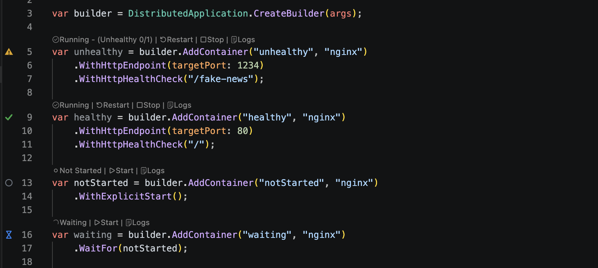
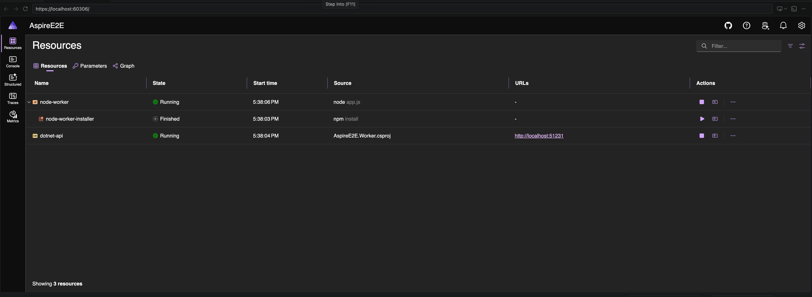

# Run your app

Use the **Run AppHost** or **Debug AppHost** buttons in the sidebar, run the commands from the Command Palette, or right-click an AppHost in the Aspire view.

When you run your app, the extension:

1. Discovers the AppHost in your workspace
2. Builds the app when needed
3. Launches all services in the correct order
4. Opens the **Aspire Dashboard** for real-time monitoring

### Debugging
When you **debug** instead of run, the extension attaches debuggers to supported services automatically. Set breakpoints in your code and they'll be hit as requests flow through your app.

### Editor indicators
While your app is running, the extension shows live resource status directly in your AppHost source file:

- **Gutter icons** — distinct shapes in the editor gutter next to each resource definition show state at a glance: a green **✓** checkmark for running and healthy, a yellow **⚠** triangle for unhealthy or degraded, a red **✕** for errors, a blue **⌛** hourglass for starting or waiting, and a grey **○** circle for not yet started.
- **CodeLens** — inline labels above each resource show the current state and health (e.g. "Running - (Unhealthy 0/1)", "Not Started", "Waiting") along with quick actions like Restart, Stop, Start, and Logs.

### The dashboard
Once your app is running, the dashboard shows all your resources, endpoints, logs, traces, and metrics in one place:

To learn more, see the [Aspire Dashboard overview](https://aspire.dev/dashboard/overview/).
