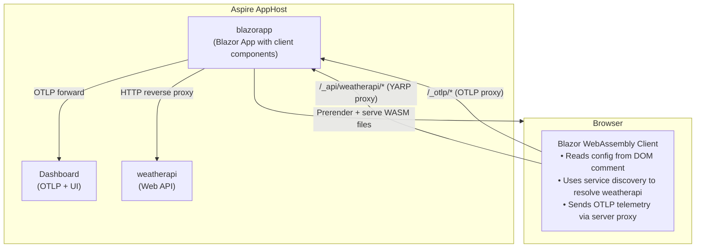
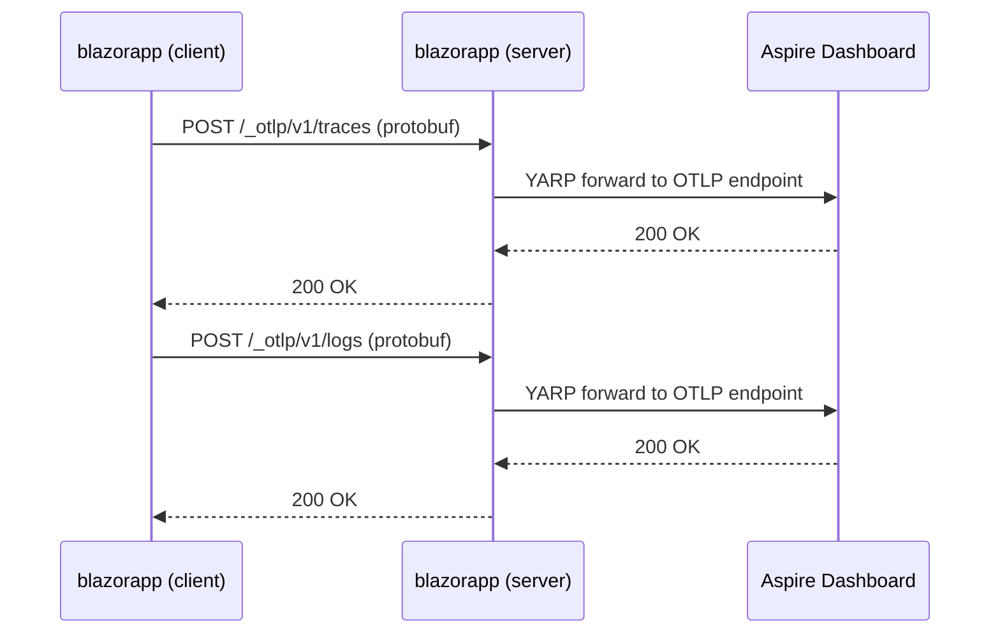

# BlazorHosted

This sample demonstrates how to integrate a **hosted Blazor WebAssembly** application (Blazor Web App with Interactive WebAssembly render mode) with Aspire, enabling full observability (logs, traces) and service discovery for both the server and the WASM client.

## Overview

In the hosted model, an ASP.NET Core application hosts the WebAssembly client. The `Aspire.Hosting.Blazor` package provides `ProxyBlazorService()` and `ProxyBlazorTelemetry()` extension methods that configure the server to:

- Proxy API requests from the WASM client to backend services via YARP
- Proxy OTLP telemetry from the WASM client to the Aspire dashboard
- Deliver client configuration (service URLs, OTLP settings) via a DOM comment embedded during prerendering

This enables:

- **Service Discovery** — WASM client resolves service endpoints at runtime
- **Distributed Tracing** — traces flow from browser → server → API → dashboard
- **Structured Logging** — client-side logs appear in Aspire dashboard as a separate `(client)` resource

## Architecture



## How It Works

### Step 1: AppHost Registers the Hosted App

The AppHost uses `ProxyBlazorService()` to make backend services available to the WASM client, and `ProxyBlazorTelemetry()` to enable client-side telemetry:

```csharp
var builder = DistributedApplication.CreateBuilder(args);

var weatherApi = builder.AddProject<Projects.BlazorHosted_WeatherApi>("weatherapi");

builder.AddProject<Projects.BlazorHosted>("blazorapp")
    .ProxyBlazorService(weatherApi)
    .ProxyBlazorTelemetry();

builder.Build().Run();
```

- `ProxyBlazorService(weatherApi)` — adds a YARP route so the WASM client can reach weatherapi via `/_api/weatherapi/*` on the server, and includes the service URL in the client configuration
- `ProxyBlazorTelemetry()` — adds a YARP route at `/_otlp/*` that proxies OTLP traffic from the browser to the Aspire dashboard, and includes the OTLP endpoint/headers in the client configuration

### Step 2: Server Embeds Configuration in DOM Comment

The hosting layer builds a client configuration JSON containing service URLs, OTLP endpoint, and headers. This is set as the `Client:ConfigResponse` configuration value on the server.

The server's `App.razor` reads this value and embeds it as a base64-encoded HTML comment:

```html
@inject IConfiguration Configuration

<body>
    <Routes />
    @{
        var configResponse = Configuration["Client:ConfigResponse"];
        if (!string.IsNullOrEmpty(configResponse))
        {
            var encoded = Convert.ToBase64String(
                System.Text.Encoding.UTF8.GetBytes(configResponse));
            @((MarkupString)$"<!--Blazor-Client-Config:{encoded}-->")
        }
    }
    <script src="_framework/blazor.web.js"></script>
</body>
```

This approach delivers configuration during the initial page load without an extra HTTP request, which is important because the WASM runtime needs the config before it starts.

### Step 3: JavaScript Initializer Reads DOM Comment

The **ClientServiceDefaults** library includes a [JavaScript initializer](https://learn.microsoft.com/aspnet/core/blazor/fundamentals/startup#javascript-initializers) that runs before the WebAssembly runtime starts:

```javascript
export async function beforeWebAssemblyStart(options) {
    const config = readConfigFromDomComment();
    if (config) {
        const envVars = config?.webAssembly?.environment;
        if (envVars && Object.keys(envVars).length > 0) {
            const prevConfigure = options.configureRuntime;
            options.configureRuntime = (builder) => {
                if (prevConfigure) prevConfigure(builder);
                for (const [key, value] of Object.entries(envVars)) {
                    builder.withEnvironmentVariable(key, value);
                }
            };
        }
    }
}
```

The `readConfigFromDomComment()` function walks the DOM looking for `<!--Blazor-Client-Config:BASE64-->`, decodes it, and parses the JSON. The values are injected as environment variables via `configureRuntime`.

### Step 4: WASM Client Bridges Environment Variables into IConfiguration

Same as the standalone model — environment variables must be bridged into `IConfiguration` for service discovery:

```csharp
var builder = WebAssemblyHostBuilder.CreateDefault(args);

// Bridge environment variables into IConfiguration
builder.Configuration.AddEnvironmentVariables();

// Add Aspire client service defaults (OpenTelemetry, service discovery, resilience)
builder.AddBlazorClientServiceDefaults();

// Named HttpClient using service discovery
builder.Services.AddHttpClient("weatherapi", client =>
{
    client.BaseAddress = new Uri("https+http://weatherapi");
});
```

### Step 5: Server Configures YARP for Proxying

The server's `Program.cs` sets up YARP to proxy requests from the WASM client. The YARP configuration is injected by the Aspire hosting layer via environment variables:

```csharp
var builder = WebApplication.CreateBuilder(args);

builder.AddServiceDefaults();

builder.Services.AddRazorComponents()
    .AddInteractiveWebAssemblyComponents();

// YARP for proxying service calls and OTLP from the WASM client
builder.Services.AddReverseProxy()
    .LoadFromConfig(builder.Configuration.GetSection("ReverseProxy"))
    .AddServiceDiscoveryDestinationResolver();

// Same named HttpClient as the WASM client — needed for prerendering
builder.Services.AddHttpClient("weatherapi", client =>
{
    client.BaseAddress = new Uri("https+http://weatherapi");
});

var app = builder.Build();
app.MapDefaultEndpoints();
app.MapReverseProxy();
app.MapRazorComponents<App>()
    .AddInteractiveWebAssemblyRenderMode()
    .AddAdditionalAssemblies(typeof(Client._Imports).Assembly);
```

**Note:** The `AddHttpClient("weatherapi")` registration is required on the server so that prerendered components can resolve the same `https+http://weatherapi` URL via service discovery.

### Step 6: Telemetry Flows Through Server to Dashboard

The WASM client sends OTLP telemetry to its own origin at `/_otlp/*`, which the server proxies to the Aspire dashboard. The client is identified as `blazorapp (client)` in the dashboard, separate from the server's `blazorapp` entry.



**Important:** WebAssembly doesn't automatically start `IHostedService`, so telemetry providers must be manually initialized:

```csharp
var host = builder.Build();

// Force initialization of OpenTelemetry providers
_ = host.Services.GetService<MeterProvider>();
_ = host.Services.GetService<TracerProvider>();

await host.RunAsync();
```

## Project Structure

```text
BlazorHosted/
├── BlazorHosted.AppHost/               # Aspire orchestrator
│   └── Program.cs                                # ProxyBlazorService + ProxyBlazorTelemetry
│
├── BlazorHosted.Server/                # Blazor Server (hosts WASM)
│   ├── Program.cs                                # YARP, service discovery, prerendering
│   └── Components/App.razor                      # Embeds client config as DOM comment
│
├── BlazorHosted.Client/                # Blazor WebAssembly client
│   ├── Program.cs                                # AddEnvironmentVariables + service discovery
│   └── Pages/Weather.razor                       # Calls WeatherAPI via HttpClientFactory
│
├── BlazorHosted.ClientServiceDefaults/  # WASM-side telemetry + config
│   ├── Extensions.cs                             # AddBlazorClientServiceDefaults()
│   ├── Telemetry/                                # Custom OTLP exporters for WebAssembly
│   └── wwwroot/*.lib.module.js                   # JS initializer: reads DOM comment config
│
├── BlazorHosted.ServiceDefaults/       # Server-side Aspire defaults
│   └── Extensions.cs                             # AddServiceDefaults() + MapConfigurationEndpoint
│
└── BlazorHosted.WeatherApi/            # Sample API
    └── Program.cs                                # Minimal API with /weatherforecast
```

## Running the Sample

1. **Start the AppHost:**
   ```bash
   cd BlazorHosted.AppHost
   dotnet run
   ```

2. **Open the Aspire Dashboard** using the login URL from the console output

3. **Navigate to the Blazor app** — click the `blazorapp` URL in the Resources page

4. **Click "Weather"** to trigger an API call through the YARP proxy

5. **View telemetry** in the Aspire dashboard:
   - **Structured Logs** — logs from `blazorapp` (server) and `blazorapp (client)` (WASM)
   - **Traces** — distributed traces: `blazorapp (client)` → `blazorapp` → `weatherapi`

## Key Differences from Standalone

| Aspect | Hosted Blazor | Standalone with Gateway |
|--------|---------------|------------------------|
| **Server** | Developer-owned Blazor Server | Auto-generated Gateway |
| **AppHost API** | `ProxyBlazorService()` + `ProxyBlazorTelemetry()` | `AddBlazorWasmProject()` + `AddBlazorGateway()` |
| **Config delivery** | DOM comment in prerendered HTML | `/_blazor/_configuration` endpoint |
| **JS initializer** | `beforeWebAssemblyStart` | `onRuntimeConfigLoaded` |
| **Prerendering** | Supported (server renders first) | Not applicable |
| **Client discriminator** | `(client)` suffix on service name | Separate resource name (e.g., `app`) |
| **CORS** | Not needed (same origin) | Not needed (gateway is same origin) |
