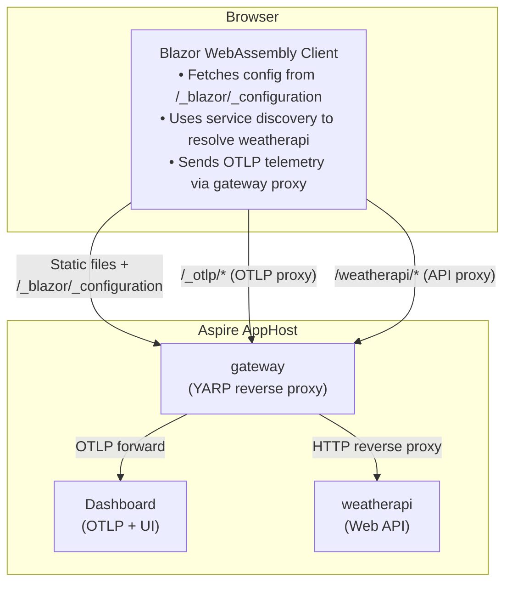
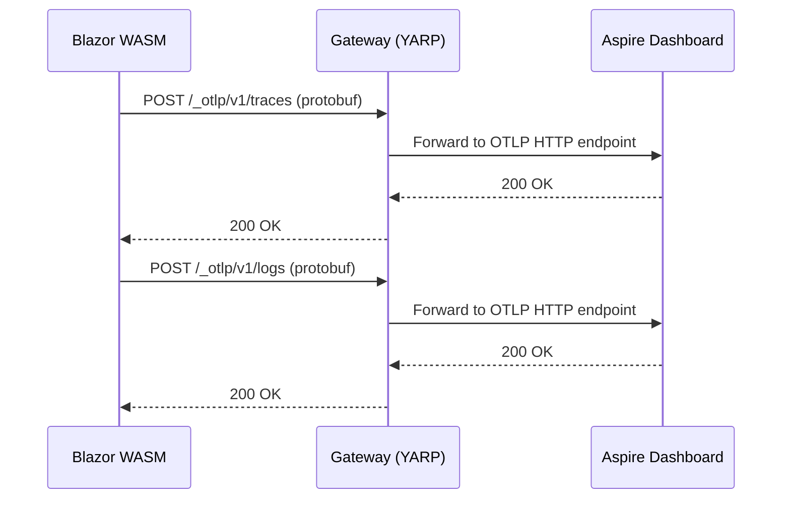

# BlazorStandalone

This sample demonstrates how to integrate a **standalone Blazor WebAssembly** application with Aspire, enabling full observability (logs, traces) and service discovery without requiring a hosted Blazor Server backend.

## Overview

For **standalone** Blazor WebAssembly applications, there is no server-side Blazor host. This sample uses the `Aspire.Hosting.Blazor` package to automatically generate a **Gateway** (an ASP.NET Core + YARP reverse proxy) that:

- Serves the WASM static files under a path prefix (e.g., `/app/`)
- Exposes a `/_blazor/_configuration` endpoint with service URLs and OTLP settings
- Proxies API traffic to backend services via YARP
- Proxies OTLP telemetry from the browser to the Aspire dashboard

This enables:

- **Service Discovery** — resolve service endpoints at runtime
- **Distributed Tracing** — traces flow from browser → gateway → API → dashboard
- **Structured Logging** — client-side logs appear in Aspire dashboard

## Architecture



## How It Works

### Step 1: AppHost Registers the WASM App and Gateway

The `Aspire.Hosting.Blazor` package provides `AddBlazorWasmProject` and `AddBlazorGateway` APIs. The AppHost declares the WASM app, its service dependencies, and the gateway:

```csharp
var builder = DistributedApplication.CreateBuilder(args);

var weatherApi = builder.AddProject<Projects.BlazorStandalone_WeatherApi>("weatherapi");

// Register the WASM app — the resource name becomes the URL path prefix (e.g., /app/)
var blazorApp = builder.AddBlazorWasmProject<Projects.BlazorStandalone>("app")
    .WithReference(weatherApi);

// The Gateway serves WASM files and proxies API + OTLP traffic
var gateway = builder.AddBlazorGateway("gateway")
    .WithExternalHttpEndpoints()
    .WithOtlpExporter(Aspire.Hosting.OtlpProtocol.HttpProtobuf)
    .WithBlazorClientApp(blazorApp);

builder.Build().Run();
```

At startup, the hosting layer:
1. Reads the WASM project's `staticwebassets.build.json` manifest to locate static files
2. Generates a `Gateway.cs` script that configures YARP routes for each WASM client
3. Builds a client configuration JSON with service URLs and OTLP settings
4. Launches the gateway as a project resource

### Step 2: Gateway Exposes Configuration Endpoint

The gateway serves a `/_blazor/_configuration` endpoint that returns the configuration needed by the WASM client:

```json
{
  "webAssembly": {
    "environment": {
      "services__weatherapi__https__0": "https://localhost:7101",
      "services__weatherapi__http__0": "http://localhost:5101",
      "OTEL_EXPORTER_OTLP_ENDPOINT": "https://localhost:65269/_otlp/",
      "OTEL_EXPORTER_OTLP_PROTOCOL": "http/protobuf",
      "OTEL_SERVICE_NAME": "app",
      "OTEL_EXPORTER_OTLP_HEADERS": "x-otlp-api-key=..."
    }
  }
}
```

Note: The OTLP endpoint points back to the gateway's own `/_otlp/` path, which proxies traffic to the Aspire dashboard. This avoids CORS issues since the browser sends telemetry to its own origin.

### Step 3: JavaScript Initializer Injects Environment Variables

The **ClientServiceDefaults** library includes a [JavaScript initializer](https://learn.microsoft.com/aspnet/core/blazor/fundamentals/startup#javascript-initializers) that runs when the .NET runtime config is loaded:

```javascript
export async function onRuntimeConfigLoaded(config) {
    const configUrl = new URL('_blazor/_configuration', document.baseURI).href;
    const response = await fetch(configUrl);
    if (response.ok) {
        const serverConfig = await response.json();
        const envVars = serverConfig?.webAssembly?.environment;
        if (envVars && Object.keys(envVars).length > 0) {
            config.environmentVariables ??= {};
            for (const [key, value] of Object.entries(envVars)) {
                config.environmentVariables[key] = value;
            }
        }
    }
}
```

This makes configuration available via `Environment.GetEnvironmentVariable()` in the WASM client.

### Step 4: WASM Client Bridges Environment Variables into IConfiguration

Environment variables are available via `Environment.GetEnvironmentVariable()`, but **not** automatically in `IConfiguration`. Since Service Discovery reads from `IConfiguration`, we bridge this gap:

```csharp
var builder = WebAssemblyHostBuilder.CreateDefault(args);

// Bridge environment variables into IConfiguration
// Converts "services__weatherapi__https__0" → "services:weatherapi:https:0"
builder.Configuration.AddEnvironmentVariables();

// Add Aspire client service defaults (OpenTelemetry, service discovery, resilience)
builder.AddBlazorClientServiceDefaults();

// Named HttpClient using service discovery
builder.Services.AddHttpClient("weatherapi", client =>
{
    client.BaseAddress = new Uri("https+http://weatherapi");
});
```

### Step 5: Telemetry Flows to Aspire Dashboard

The **ClientServiceDefaults** package configures OpenTelemetry to send logs and traces to the OTLP endpoint (which points to the gateway's `/_otlp/` proxy). The gateway forwards this traffic to the Aspire dashboard.



**Important:** WebAssembly doesn't automatically start `IHostedService`, so the telemetry providers must be manually initialized:

```csharp
var host = builder.Build();

// Force initialization of OpenTelemetry providers
// Required because IHostedService doesn't run in WebAssembly
_ = host.Services.GetService<MeterProvider>();
_ = host.Services.GetService<TracerProvider>();

await host.RunAsync();
```

## Project Structure

```text
BlazorStandalone/
├── BlazorStandalone.AppHost/           # Aspire orchestrator
│   └── Program.cs                                # AddBlazorWasmProject + AddBlazorGateway
│
├── BlazorStandalone/                   # Standalone Blazor WASM client
│   ├── Program.cs                                # AddEnvironmentVariables() + service discovery
│   └── Pages/Weather.razor                       # Calls WeatherAPI via HttpClientFactory
│
├── BlazorStandalone.ClientServiceDefaults/  # WASM-side telemetry + config
│   ├── Extensions.cs                             # AddBlazorClientServiceDefaults()
│   ├── Telemetry/                                # Custom OTLP exporters for WebAssembly
│   └── wwwroot/*.lib.module.js                   # JS initializer: fetches /_blazor/_configuration
│
├── BlazorStandalone.ServiceDefaults/   # Server-side Aspire defaults
│   └── Extensions.cs                             # Standard AddServiceDefaults()
│
└── BlazorStandalone.WeatherApi/        # Sample API
    └── Program.cs                                # Minimal API with /weatherforecast
```

## Running the Sample

1. **Start the AppHost:**
   ```bash
   cd BlazorStandalone.AppHost
   dotnet run
   ```

2. **Open the Aspire Dashboard** using the login URL from the console output

3. **Navigate to the WASM app** — click the gateway URL in the Resources page, then append `/app/`

4. **Click "Weather"** to trigger an API call through the YARP proxy

5. **View telemetry** in the Aspire dashboard:
   - **Structured Logs** — logs from `gateway` (server) and `app` (WASM client)
   - **Traces** — distributed traces: `app` → `gateway` → `weatherapi`

## Key Differences from Hosted Blazor

| Aspect | Hosted Blazor | Standalone with Gateway |
|--------|---------------|------------------------|
| **Server** | Blazor Server hosts WASM | Auto-generated Gateway hosts WASM |
| **Config delivery** | DOM comment in rendered HTML | `/_blazor/_configuration` endpoint |
| **JS initializer** | `beforeWebAssemblyStart` | `onRuntimeConfigLoaded` |
| **Telemetry proxy** | Through server's `/_otlp/*` route | Through gateway's `/_otlp/*` route |
| **Service discovery** | Works out of the box | Requires `AddEnvironmentVariables()` |
| **Client discriminator** | `(client)` suffix on service name | Separate resource name (e.g., `app`) |
| **CORS** | Not needed (same origin) | Not needed (gateway is same origin) |
